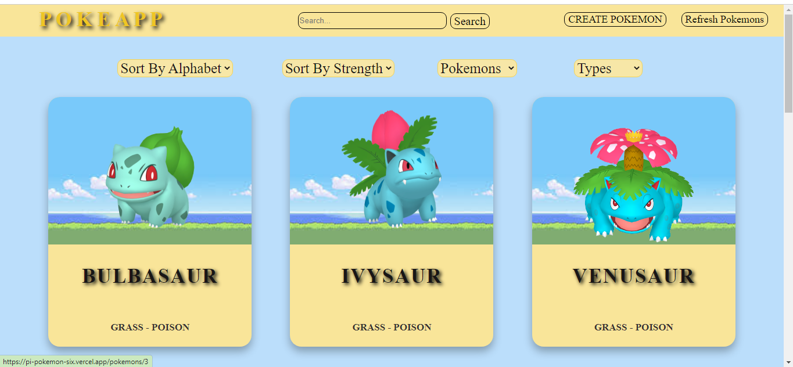
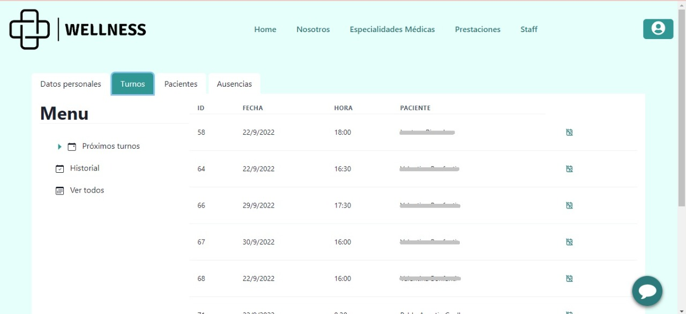

  <h1 align="center">Hi 👋, I'm Valentina Bonfanti</h1>
  

    
   
   

 

  
 
  
  
### :man_technologist: About Me :
  I am a Full Stack Developer  from Argentina.
  
- 🤔 &nbsp; Exploring new technologies and developing new projects.
- 🎓 &nbsp; Graduated as Full Stack Developer of Henry Academy.
- 💼 &nbsp; I'm currently looking for work.
<h3>Tech Stack</h3>

- 💻 &nbsp;
  
  
  
  
  
  
  

 

 - 🌐 &nbsp;
  
  
  
  
  

- ⚙️ &nbsp;

 

&nbsp;

## :pushpin: My projects

<a href="https://pi-pokemon-six.vercel.app/" target="_blank" rel="noreferrer"><h3>POKEAPP</h3></a>

It's my first proyect, is a SPA about pokemons entirely developed by me.You can filter the pokemons, sort them and also create one by yourself. The page consumes data from an API and is where the information about the pokemons comes from, also the ones that are created cames from a database SQL.

  
  
  
  
  

 

<a href="https://pf-wellness-iota.vercel.app/" target="_blank" rel="noreferrer"><h3>WELLNESS</h3></a>

This is an application that we developed in group for the final proyect in Henry's Bootcamp. It's about a page where you can take dates with differents doctors in a hospital, also, in the patient panel view, you can modify your profile once you're login and you can cancel the dates if you have to. The page have two more panels of control, one for the doctor side and one for the adiministrator, they can manage differents things too, like holidays, schedules, statics and more. 

  
  
  
  
  

  
  
  
  
  

